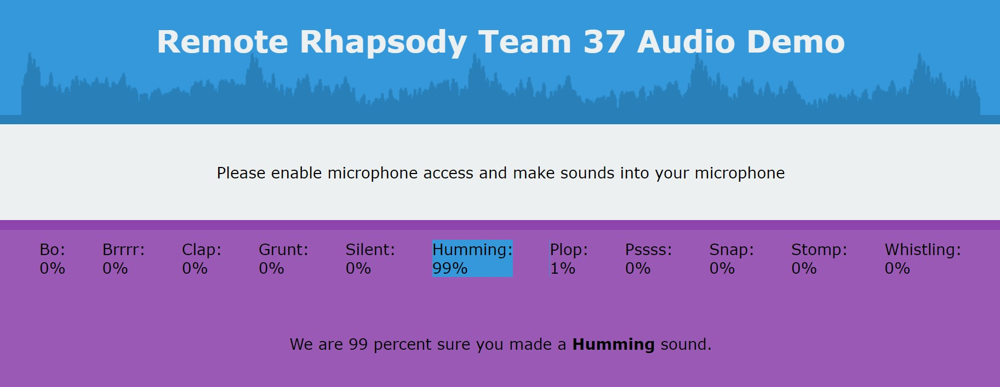

# SoundClassificationDemo
 Remote Rhapsody Team 37 Audio Demo


 - [visit the live demo website](https://rr.melde.net/)

 - [view a video of the demo on Youtube](https://youtu.be/j_n0egM2tq4)



This repository is part of the project
**SUPERSONIC A MICRO SOUND SYNTHESIZER:** _make music from your speech_.
[More Information is available on  the project page](https://remote-rhapsody-platform.hubraum.com/#/projects/5fbfa744ac10a7001b65dc1a)


## Deployment Info
Microphone access will only work if you have a HTTPS certificate configured on your server.

## Installation and Running
```
apt install npm
npm install express
express ExpressHTTPS.js
```

## Overview:
The `ExpressHTTPS.js` file starts a simple webserver redirecting http to https and serving the content of the current folder to the https website.

The `index.html` files contains every structure, design and logic the website needs. It includes the `Tensorflow.js` library and the machine learning model files from the `model` subfolder.
